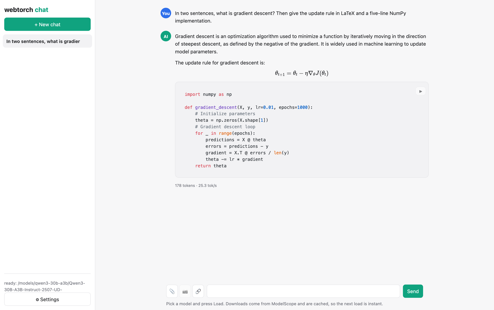
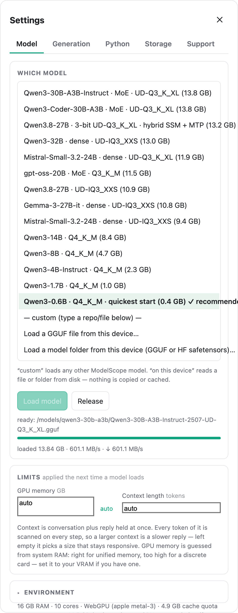
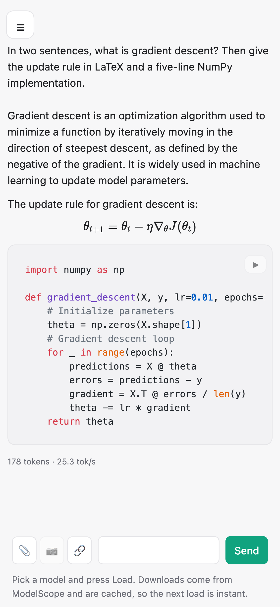

<div align="center">

# webtorch

### Run a 30-billion-parameter model in a browser tab.

**No server. No install. No native runtime.**
PyTorch-compatible, on the GPU, in Python — inside the page.



<sub>Qwen3-30B-A3B answering in a tab — 13.8 GB of weights, 25 tok/s, nothing installed.</sub>

[Quickstart](#quickstart) · [What it does](#what-it-does) · [Speed](#speed) ·
[The chat app](#the-chat-app) · [Docs](docs/API.md)

</div>

---

```python
# ── this is running inside the browser tab ──
import webtorch
webtorch.use_default_io()

lm = await webtorch.AutoModelForCausalLM.from_pretrained("/models/qwen3-30b-a3b.gguf")
print(lm.generate("Why is this surprising?", max_new=64))
```

Nothing was downloaded to the machine. Nothing was installed. The weights were read
by range straight from disk or a hub, the layers ran on the GPU through WebGPU, and the
whole thing was CPython — compiled to WebAssembly — executing in a worker.

## What it does

**Drop-in PyTorch.** `install_torch()` and `import torch` resolves here. `Tensor` with
autograd, `nn.{Linear, Conv1d/2d/3d, LayerNorm, RMSNorm, MultiheadAttention, …}`,
`optim.{SGD, Adam, AdamW}`. Trains real GPT/CNN/Transformer models on WebGPU **and** WebGL.

**LLMs by config, not by a supported-model list.** `AutoModelForCausalLM.from_pretrained`
reads the model's own config and runs the CausalLM family (Qwen2/Qwen3/Llama-shaped) and the
MoE family, from an AutoGPTQ directory, a **GGUF** file, or a plain **fp16/bf16 HF** folder —
at int4, int8, or fp16. Twenty-eight quantisation formats, from `Q4_K` to the 2-bit i-quants.

**Streaming quantisation.** Turn an fp16 model into int4/int8 without ever holding it in RAM:
weights stream in and quantised shards stream out through your own async IO callbacks. The
output is standard AutoGPTQ, loadable by auto_gptq / vLLM / transformers.

**Multimodal, generically.** `register_encoder` + `MultimodalLM` pair **any** decoder with
**any** media encoder, so vision and audio are not welded to one model family. Ships
text-to-speech (CosyVoice2 with zero-shot voice cloning, VITS), detection (YOLO/DETR) and
vision-language (Qwen2.5-VL).

**A generic ONNX runtime.** Any `.onnx`, a pure-Python parser and ~50 ops, no dependencies.

**Task pipelines, an open registry.** `pipeline("text-generation" | "text-to-speech" |
"object-detection" | "image-to-text" | …)`. The built-in names are *pre-registered* loaders;
register your own task without touching the SDK.

**Bring your own IO — and you must.** The core does no IO itself. The callback you install
decides where bytes come from: `use_default_io()` for your own files, `hf_read()` /
`modelscope_read()` for a hub repo id, or your own `set_io_read` / `set_io_write` for any
storage at all. Reads are cached, resumable, and persist across reloads.

## Speed

These are the models running *in the tab*, not a server. Apple silicon (`metal-3`),
end-to-end tok/s from a clean load, same prompt and same warm-up on both backends, each
figure the middle of three or four runs:

| Model | Size on disk | WebGPU | WebGL |
|---|---:|---:|---:|
| Qwen3-0.6B · Q4_K_M | 0.4 GB | **118.6** | 19.8 |
| Qwen3-30B-A3B · MoE · Q3_K_XL | 13.8 GB | **34.8** | 5.1 |
| Qwen 3B · Q4_K | 2.0 GB | **35.7** | 5.3 |
| Qwen3.8-27B · hybrid SSM · i-quant | 13.0 GB | **6.8** | 0.76 |

On WebGPU, weight streaming runs at the hardware's read ceiling for every quantisation
format, and what is left is decode arithmetic — close to uniform across formats.

**WebGL is a fallback, not a peer.** Every kernel exists on it and every format is checked
against the reference decoder there too, but expect 6–9×. The reason is structural rather
than unfinished: WebGL2 has no compute stage, so each kernel is a fragment shader with one
invocation per output value and no memory shared between invocations. A thread cannot stage
the activations for its neighbours, so each one re-reads them — measured, that costs more
than reading the weights does.

## The chat app

A complete local chat client lives in [`chat/`](chat/) — the SDK driving a real interface.

<table>
<tr>
<td width="55%" valign="top">

<br><sub><b>Pick anything.</b> The presets span 0.4 GB to 13.8 GB — dense, MoE and hybrid-SSM — and the last three entries are “any other repo id”, “a GGUF from this device”, “a folder from this device”.</sub>
</td>
<td width="45%" valign="top">

<br><sub><b>And on a phone.</b> The same client, the same rendering — code scrolls in its own track rather than stretching the page.</sub>
</td>
</tr>
</table>

- **Any model that fits.** Load a GGUF or an HF folder from the device, or any repo id from a
  hub. The list is examples, not a whitelist; the only real limit is GPU memory.
- **Replies that render.** Markdown, syntax-highlighted code, LaTeX typeset with KaTeX,
  tables. Sanitised before it reaches the DOM.
- **Press the code.** A Python block gets a ▶ and runs in its own Pyodide — separate from the
  one holding the model — with output, tracebacks and matplotlib figures inline. numpy,
  pandas and matplotlib are loaded before you ask; add wheels from a URL or from disk.
- **Edit anything, block by block.** A paragraph as text, a code block in the block, a table
  cell by cell — a formula cell opens as LaTeX, an image cell as an image.
- **Works offline.** A service worker keeps every wheel, the wasm and the runtime
  permanently; the app's own files stay network-first, so an update still lands the moment
  there is a network.
- **On a phone**, too.

## Quickstart

Needs the COOP/COEP headers that `SharedArrayBuffer` requires, and a GPU backend: WebGPU
(Chrome/Edge 113+, Safari 18+) for the speeds above, or WebGL as a slower fallback. Without
either, the weights fall back to the page's WASM heap — about 4 GB in total — and anything
past roughly 2 GB runs out of memory while loading rather than running slowly.

```bash
# 1. build the WgPy backend wheels + fetch Pyodide (one-time) → docs/BUILD.md
# 2. serve with the required headers
node serve-coi.mjs . 8119
# 3. open http://localhost:8119/chat/   (or /webapp/ for the example runner)
```

Full steps, including where to get weights: **[docs/BUILD.md](docs/BUILD.md)**.

## Where things are

```
webtorch/            the SDK
  _core.py             torch-compatible Tensor / autograd / nn / optim + the GPU kernels
  _sdk.py              transformers-style facade + the task-pipeline registry
  lm_engine.py         generic decoder (dense + MoE) + samplers + capture/replay
  quantize.py          streaming quantiser (IO-free core)
  webio.py             the only IO layer: global callbacks, hub readers, cache management
  onnxrt.py            generic ONNX runtime
  torchshim.py         `import torch` compatibility
chat/                the chat app (index.html, app.js, worker.js, pyworker.js)
webapp/              example runner
examples/            runnable examples
docs/                API.md · SDK_README.md · ARCHITECTURE.md · BUILD.md · WGPY_BACKEND.md
src/ webgl/ webgpu/ wgpy/ cupy/ cupyx/     vendored WgPy backend (modified — see NOTICE)
```

Weights (`models/`), the Pyodide runtime (`lib/`) and build output are not in git.

## Docs

- [SDK usage](docs/SDK_README.md) — torch, LLMs, quantisation, pipelines
- [API reference](docs/API.md)
- [Architecture](docs/ARCHITECTURE.md) — how webtorch sits on WgPy
- [Build](docs/BUILD.md) — backend, models, running the demo
- [WgPy backend](docs/WGPY_BACKEND.md)

## License

MIT — see [LICENSE](LICENSE). Built on **WgPy** (© The University of Tokyo, Edge Intelligence
Systems, Inc.; MIT), whose WebGPU/WebGL backend is modified here: batched matmul, graph
capture/replay, fused kernels, and the quantised matmul kernels. See [NOTICE](NOTICE).

The chat app renders with [marked](https://github.com/markedjs/marked),
[DOMPurify](https://github.com/cure53/DOMPurify), [KaTeX](https://katex.org) and
[highlight.js](https://highlightjs.org), loaded from a CDN at runtime.
