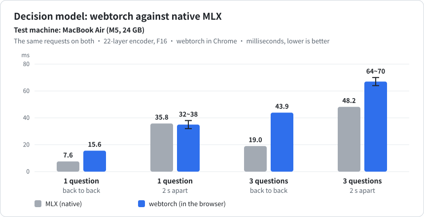

<div align="center">

# webtorch

### Large language models in a browser tab. No install, no drivers, any GPU.

On a fanless **MacBook Air (M5, 24 GB)**, in Chrome: **Qwen3-0.6B at 175+ tokens/s** · **a 30B MoE at 42 tokens/s** · **a 22-layer decision model in 15 ms**

## ▶ [Try it now: it runs in your browser](https://xnetsc.github.io/webpytorch/chat/)

<sub>Nothing to install and nothing uploaded: the weights go to your browser's own cache and
the model runs on your GPU. Start with <b>Qwen3-0.6B (0.4 GB)</b> and you are chatting in
under a minute; the multi-gigabyte models are the same page, just a longer download.</sub>


<sub>Qwen3-30B-A3B answering in a tab: 13.8 GB of weights, nothing installed.</sub>

**English** · [中文](README.zh.md) · [Live demo](https://xnetsc.github.io/webpytorch/chat/) ·
[Quickstart](#quickstart) · [Speed](#speed) · [Docs](docs/API.md) ·
How it was built: [English](docs/articles/webtorch-share.en.md) · [中文](docs/articles/webtorch-share.zh.md)

</div>

---

## Why webtorch

**Nothing to set up.** No CUDA, no ROCm, no driver versions to match, no Python environment,
no build. Open a page and the model runs. The browser turns one WGSL source into Metal, Vulkan
or D3D12, so GPU vendors and driver versions are the browser's problem, not yours.

**Every GPU.** Apple, NVIDIA, AMD and Intel, integrated or discrete, through WebGPU, with WebGL2
where WebGPU is missing. Nothing about the device is assumed: each kernel's features, buffers and
workgroup memory are checked against what the device reports before it is used, so a model that
loads on one laptop loads on the next.

**The fastest path on your machine, picked by itself.** At load, every operator's candidate
kernels, tiles and thread shapes are raced on your GPU, timed by its own timestamps, and the
winner is kept for that GPU, so the next load starts at full speed. There is no tuning table for
one vendor and nothing to call. Weights compute in the format they are stored in (Q4_K is decoded
as Q4_K inside the shader); a faster lower-precision route is taken only on the weights where it
passes an accuracy check.

**Stays fast.** `remeasure()` races the loaded model's choices again within a time budget,
stoppable at any moment without losing what finished. The set of routes it replaced is kept:
`switchRoutes()` goes back and forth between the two, and `onRoutesSlower` tells you if the set
in use runs slower than the other one did.

**Private by construction.** Weights live in the browser's cache and prompts never leave the
machine. The compute is the user's own, so there is no per-request server bill.

**PyTorch, in Python, in the page.** CPython compiled to WebAssembly runs in a worker, and
`import torch` resolves to webtorch: `Tensor` with autograd, `nn`, `optim`, GGUF, GPTQ and HF
weights, twenty-eight quantisation formats.

```python
# ── this is running inside the browser tab ──
import webtorch
webtorch.use_default_io()

lm = await webtorch.AutoModelForCausalLM.from_pretrained("/models/qwen3-30b-a3b.gguf")
print(lm.generate("Why is this surprising?", max_new=64))
```

## Speed

In the tab, not on a server: a fanless MacBook Air (M5, 24 GB), Chrome, WebGPU, greedy decoding.

| Model | On disk | In the browser |
|---|---:|---:|
| Qwen3-0.6B · Q4_K_M | 0.4 GB | **175+ tokens/s** |
| Qwen3-30B-A3B · MoE · UD-Q3_K_XL | 13.8 GB | **42 tokens/s** |
| Qwen3.8-27B · hybrid SSM · UD-Q2_K_XL | 9.8 GB | **7 to 8 tokens/s** |
| 22-layer decision model · F16 | 0.7 GB | **15.6 ms** a question |

Against native MLX on the same machine, with the same requests:



Asked the way people ask, one question every couple of seconds, the browser matches native MLX.
Where MLX is ahead, it is using the matrix units in Apple's GPU. Some GPUs have hardware features
like these (NVIDIA's Tensor Cores are another) that WebGPU does not expose yet, so native code keeps
part of an edge for now; as WebGPU adds them, the two converge. MLX itself runs only on Apple
silicon; the same webtorch page runs on NVIDIA, AMD and Intel GPUs too.

## What else it does

**LLMs by config, not by a supported-model list.** `AutoModelForCausalLM.from_pretrained`
reads the model's own config and runs the CausalLM family (Qwen2/Qwen3/Llama-shaped), the MoE
family and hybrid recurrent models, from an AutoGPTQ directory, a **GGUF** file, or a plain
**fp16/bf16 HF** folder. Twenty-eight quantisation formats, from `Q4_K` to the 2-bit i-quants.

**Drop-in PyTorch.** `install_torch()` and `import torch` resolves here. `Tensor` with
autograd, `nn.{Linear, Conv1d/2d/3d, LayerNorm, RMSNorm, MultiheadAttention, …}`,
`optim.{SGD, Adam, AdamW}`. Trains real GPT/CNN/Transformer models on WebGPU **and** WebGL.

**Decisions, typed.** `decide(state, questions)` answers structured questions (a choice, a
yes or no, a score) with the whole distribution for each, from a decision model's own config.

**Streaming quantisation.** Turn an fp16 model into int4/int8 without ever holding it in RAM:
weights stream in and quantised shards stream out through your own async IO callbacks. The
output is standard AutoGPTQ, loadable by auto_gptq / vLLM / transformers.

**Multimodal, generically.** `register_encoder` + `MultimodalLM` pair **any** decoder with
**any** media encoder, so vision and audio are not welded to one model family. Ships
text-to-speech (CosyVoice2 with zero-shot voice cloning, VITS), detection (YOLO/DETR) and
vision-language (Qwen2.5-VL).

**Say what the output may be.** A constraint sees the text so far and answers which
continuations are still valid, so `generate(..., constraint="json")` cannot emit malformed
JSON. Constraints are a callback, not a fixed list: yours is asked for the allowed set at
every step, and may also say *take this and stop*, or *stop asking me*. That machinery is
what makes **tool calling** work on small models: `tools=[...]`, and the call is parsed out
of whatever delimiters the model's own template uses, with `require_known_tools=True` making
an invented tool name unrepresentable rather than merely unlikely.

**A generic ONNX runtime.** Registered ONNX graphs, a pure-Python parser and ~50 ops, no
dependencies; quantized integer matmul and convolution keep INT8/UINT8 inputs with INT32
accumulation instead of silently widening the stored tensors to floating point.

**Task pipelines, an open registry.** `pipeline("text-generation" | "text-to-speech" |
"object-detection" | "image-to-text" | …)`. The built-in names are *pre-registered* loaders;
register your own task without touching the SDK.

**Bring your own IO.** The core does no IO itself. The callback you install decides where bytes
come from: `use_default_io()` for your own files, `hf_read()` / `modelscope_read()` for a hub
repo id, or your own `set_io_read` / `set_io_write` for any storage at all. Reads are cached,
resumable, and persist across reloads.

## The chat app

A complete local chat client lives in [`chat/`](chat/): the SDK driving a real interface.
It is deployed as it stands: **[open it](https://xnetsc.github.io/webpytorch/chat/)**, and
everything below is a page you can use rather than a screenshot of one.

<table>
<tr>
<td width="55%" valign="top">

<br><sub><b>Pick anything.</b> The presets span 0.4 GB to 13.8 GB (dense, MoE and hybrid-SSM), and the last three entries are “any other repo id”, “a GGUF from this device”, “a folder from this device”.</sub>
</td>
<td width="45%" valign="top">

<br><sub><b>And on a phone.</b> The same client, the same rendering; code scrolls in its own track rather than stretching the page.</sub>
</td>
</tr>
</table>

- **Any model that fits.** Load a GGUF or an HF folder from the device, or any repo id from a
  hub. The list is examples, not a whitelist; the only real limit is GPU memory.
- **Typed image decisions.** The optional Laya Vision preset exposes an image picker only after
  its model surface declares image input, then keeps the same `decide(state, questions)` protocol
  as text decisions and reuses cached features for an unchanged image.
  The browser publication is an FP16 ONNX export of the pinned official 201M checkpoint, not the
  withdrawn quality-reduced web checkpoint. Its base model declares English; Chinese input is not
  a published or validated capability.
- **Replies that render.** Markdown, syntax-highlighted code, LaTeX typeset with KaTeX,
  tables. Sanitised before it reaches the DOM.
- **The model can press it too.** Python and JavaScript are offered to the model as tools;
  it writes the call, the page runs it and hands back the result. Which tools exist is the
  app's decision: the SDK parses and constrains them, it does not pick them.
- **Press the code.** A Python block gets a ▶ and runs in its own Pyodide (separate from the
  one holding the model), with output, tracebacks and matplotlib figures inline. numpy,
  pandas and matplotlib are loaded before you ask; add wheels from a URL or from disk.
- **Edit anything, block by block.** A paragraph as text, a code block in the block, a table
  cell by cell: a formula cell opens as LaTeX, an image cell as an image.
- **Works offline.** A service worker keeps every wheel, the wasm and the runtime
  permanently; the app's own files stay network-first, so an update still lands the moment
  there is a network.
- **On a phone**, too.

## Quickstart

Needs the COOP/COEP headers that `SharedArrayBuffer` requires, and a GPU backend: WebGPU
(Chrome/Edge 113+, Safari 18+) for the speeds above, or WebGL as a fallback. Without either,
the weights fall back to the page's WASM heap (about 4 GB in total), and anything past roughly
2 GB runs out of memory while loading rather than running slowly.

```bash
# 1. build the WgPy backend wheels + fetch Pyodide (one-time) → docs/BUILD.md
# 2. serve with the required headers
node serve-coi.mjs . 8119
# 3. open http://localhost:8119/chat/   (or /webapp/ for the example runner)
```

Full steps, including where to get weights: **[docs/BUILD.md](docs/BUILD.md)**.

## Where things are

```
webtorch/            the SDK
  _core.py             torch-compatible Tensor / autograd / nn / optim + the GPU kernels
  _sdk.py              transformers-style facade + the task-pipeline registry
  llm.py               loading, prefill/decode, KV reuse, chat templates, tool calling
  lm_engine.py         generic decoder (dense + MoE) + samplers + capture/replay
  decision.py          typed decisions over an encoder
  constrain.py         output constraints (callback, json, regex, choices, …)
  toolcall.py          reading/writing tool calls in whatever form a model uses
  quantize.py          streaming quantiser (IO-free core)
  webio.py             the only IO layer: global callbacks, hub readers, cache management
  onnxrt.py            generic ONNX runtime
  torchshim.py         `import torch` compatibility
chat/                the chat app (index.html, app.js, cache-sw.js, pyworker.js)
webtorch-sw.js       the SDK's service worker: cross-origin isolation for static hosts
webapp/              example runner
examples/            runnable examples
docs/                API.md · SDK_README.md · ARCHITECTURE.md · BUILD.md · WGPY_BACKEND.md · articles/
src/ webgl/ webgpu/ wgpy/ cupy/ cupyx/     vendored WgPy backend (modified, see NOTICE)
```

Weights (`models/`), the Pyodide runtime (`lib/`) and build output are not in git.

## Docs

- [SDK usage](docs/SDK_README.md): torch, LLMs, quantisation, pipelines
- [API reference](docs/API.md)
- [Architecture](docs/ARCHITECTURE.md): how webtorch sits on WgPy
- [Build](docs/BUILD.md): backend, models, running the demo
- [WgPy backend](docs/WGPY_BACKEND.md)
- How it was built, as a write-up: the design, what went wrong and why, in
  [English](docs/articles/webtorch-share.en.md) and [中文](docs/articles/webtorch-share.zh.md)

## License

MIT, see [LICENSE](LICENSE). Built on **WgPy** (© The University of Tokyo, Edge Intelligence
Systems, Inc.; MIT), whose WebGPU/WebGL backend is modified here: batched matmul, graph
capture/replay, fused kernels, and the quantised matmul kernels. See [NOTICE](NOTICE).

The chat app renders with [marked](https://github.com/markedjs/marked),
[DOMPurify](https://github.com/cure53/DOMPurify), [KaTeX](https://katex.org) and
[highlight.js](https://highlightjs.org), loaded from a CDN at runtime.
