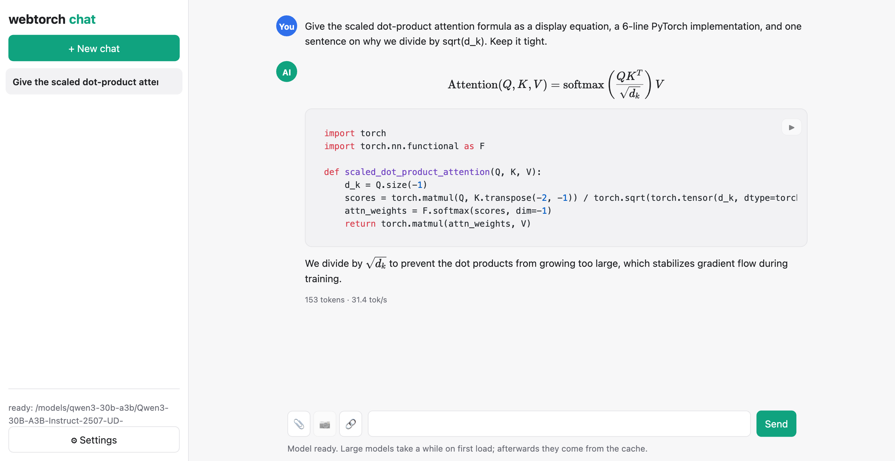
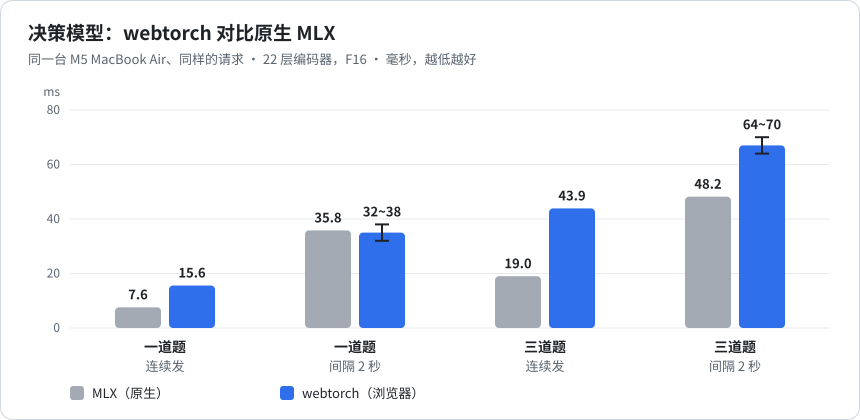
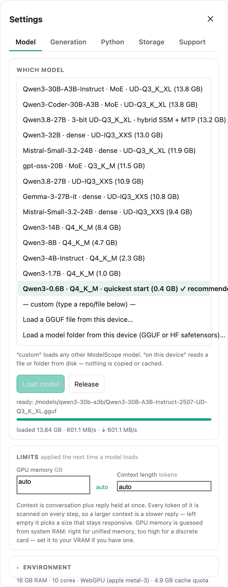
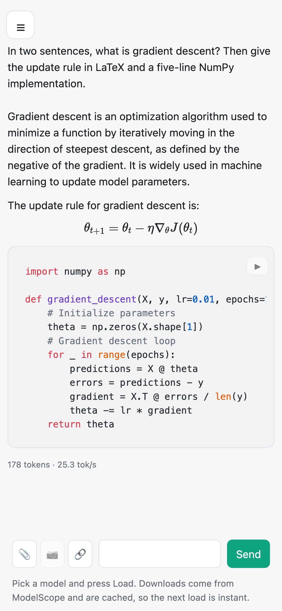

<div align="center">

# webtorch

### 浏览器标签页里跑大模型。不用安装，不用配驱动，什么显卡都能跑。

无风扇的 **M5 MacBook Air**，Chrome 里：**Qwen3-0.6B 每秒 175 个 token 以上** · **30B MoE 每秒 42 个** · **22 层决策模型 15 毫秒一道题**

## ▶ [马上试：直接在浏览器里跑](https://xnetsc.github.io/webpytorch/chat/)

<sub>什么都不用装，什么都不上传：权重存在浏览器自己的缓存里，模型在你的显卡上算。先试
<b>Qwen3-0.6B（0.4 GB）</b>，一分钟内就能聊上；几个 GB 的大模型是同一个页面，只是下载久一点。</sub>



<sub>Qwen3-30B-A3B 在标签页里回答：13.8 GB 权重，什么都没装。</sub>

[English](README.md) · **中文** · [在线体验](https://xnetsc.github.io/webpytorch/chat/) ·
[快速开始](#快速开始) · [速度](#速度) · [文档](docs/API.md) ·
技术分享：[中文](docs/articles/webtorch-share.zh.md) · [English](docs/articles/webtorch-share.en.md)

</div>

---

## 为什么是 webtorch

**不用配环境。** 不装 CUDA、ROCm，不对驱动版本，不配 Python 环境，不编译。打开网页，模型就跑起来了。一份 WGSL，浏览器翻译成 Metal、Vulkan 或 D3D12，显卡厂商和驱动版本的差异是浏览器的事。

**什么显卡都能跑。** 苹果、英伟达、AMD、Intel，集显独显都行，走 WebGPU；没有 WebGPU 的环境退到 WebGL2。设备能力一律先问再用：每个内核要用的特性、缓冲区、共享内存，都先对照设备报上来的能力检查，这台电脑能加载，换一台也能加载。

**自动选最快的路线。** 加载时，每个算子的几种实现（内核、分块、线程形状）在你的显卡上当场比一遍，用 GPU 自己的时间戳计时，赢的按显卡记下来，下次加载直接全速。没有给某家厂商写死的调优表，也不用调用任何接口。权重按存储格式直接算（Q4_K 就在着色器里按 Q4_K 解码），更快的低精度路线只在通过精度校验的权重上用。

**一直快。** `remeasure()` 在限定时间内把当前模型的路线重新比一遍，随时能停，比完的都保留。被换下的那套路线也留着：`switchRoutes()` 两套之间随时切；正在用的那套跑得比另一套慢，`onRoutesSlower` 会通知。

**天然隐私。** 权重在浏览器缓存里，问了什么都不出本机。算力是用户自己的，没有按次计费的服务器账单。

**PyTorch 写法，Python 跑在页面里。** CPython 编译成 WebAssembly 跑在 Worker 里，`import torch` 直接指向 webtorch：`Tensor`、自动求导、`nn`、`optim`，能加载 GGUF、GPTQ、HF 权重，支持 28 种量化格式。

```python
# ── 这段就在浏览器标签页里跑 ──
import webtorch
webtorch.use_default_io()

lm = await webtorch.AutoModelForCausalLM.from_pretrained("/models/qwen3-30b-a3b.gguf")
print(lm.generate("为什么这件事让人意外？", max_new=64))
```

## 速度

在标签页里测的，不是服务器：无风扇的 M5 MacBook Air、Chrome、WebGPU，贪心解码。

| 模型 | 体积 | 浏览器里的速度 |
|---|---:|---:|
| Qwen3-0.6B · Q4_K_M | 0.4 GB | **每秒 175 个 token 以上** |
| Qwen3-30B-A3B · MoE · UD-Q3_K_XL | 13.8 GB | **每秒 42 个 token** |
| Qwen3.8-27B · 混合 SSM · UD-Q2_K_XL | 9.8 GB | **每秒 7 到 8 个 token** |
| 22 层决策模型 · F16 | 0.7 GB | **一道题 15.6 毫秒** |

同一台机器、同样的请求，和原生 MLX 比：



按日常用法，隔几秒问一道题，浏览器里和原生 MLX 打平。

## 还能做什么

**按配置跑大模型，没有支持列表。** `AutoModelForCausalLM.from_pretrained` 读模型自己的配置，跑 CausalLM 系（Qwen2、Qwen3、Llama 结构）、MoE 系和混合循环结构，权重可以是 AutoGPTQ 目录、**GGUF** 文件，或者普通的 **fp16/bf16 HF** 目录。支持 28 种量化格式，从 `Q4_K` 到 2 bit 的 i-quant。

**直接替换 PyTorch。** `install_torch()` 之后 `import torch` 就指到这里。`Tensor` 带自动求导，`nn.{Linear, Conv1d/2d/3d, LayerNorm, RMSNorm, MultiheadAttention, …}`，`optim.{SGD, Adam, AdamW}`。在 WebGPU **和** WebGL 上都能训练真实的 GPT、CNN、Transformer。

**结构化决策。** `decide(state, questions)` 回答结构化的问题（选一个、是或否、打分），每道题给出完整的概率分布，题型由决策模型自己的配置决定。

**流式量化。** fp16 模型转 int4/int8，全程不用整个装进内存：权重流进来，量化好的分片通过你自己的异步 IO 回调流出去。输出是标准 AutoGPTQ 格式，auto_gptq、vLLM、transformers 都能加载。

**通用多模态。** `register_encoder` + `MultimodalLM` 能把**任意**解码器和**任意**媒体编码器接在一起，视觉、音频不绑死在某一个模型系列上。自带语音合成（CosyVoice2 零样本克隆、VITS）、目标检测（YOLO、DETR）和图文模型（Qwen2.5-VL）。

**限定输出的样子。** 约束能看到已经生成的文字，决定接下来哪些续写还合法，所以 `generate(..., constraint="json")` 不可能吐出坏 JSON。约束是回调，不是固定列表：每一步都问你的回调允许什么，回调也可以说"取这个然后停"或者"别再问我"。小模型能做**工具调用**靠的就是这套：传 `tools=[...]`，按模型自己模板里的分隔符把调用解析出来；`require_known_tools=True` 让模型根本写不出不存在的工具名。

**通用 ONNX 运行时。** 注册 ONNX 计算图，纯 Python 解析器，约 50 个算子，没有依赖；量化的整数矩阵乘和卷积保持 INT8/UINT8 输入、INT32 累加，不偷偷把存储的张量放宽成浮点。

**任务流水线，注册表开放。** `pipeline("text-generation" | "text-to-speech" | "object-detection" | "image-to-text" | …)`。内置的名字只是*预注册*的加载器，你自己的任务不用改 SDK 就能注册。

**IO 自己接。** 核心不做 IO，从哪里读字节由你装的回调决定：`use_default_io()` 读本地文件，`hf_read()` / `modelscope_read()` 按仓库 id 从模型站读，或者用 `set_io_read` / `set_io_write` 接任何存储。读过的会缓存，能断点续传，刷新页面也还在。

## 聊天应用

[`chat/`](chat/) 里是一个完整的本地聊天客户端，用 SDK 驱动真实的界面。部署的就是这份代码：**[打开它](https://xnetsc.github.io/webpytorch/chat/)**，下面说的都是能直接用的页面，不是截图。

<table>
<tr>
<td width="55%" valign="top">

<br><sub><b>什么模型都能选。</b> 预设从 0.4 GB 到 13.8 GB（稠密、MoE、混合 SSM），最后三项是"任意仓库 id""本机的 GGUF""本机的目录"。</sub>
</td>
<td width="45%" valign="top">

<br><sub><b>手机上也行。</b> 同一个客户端、同样的渲染；代码块在自己的区域里横向滚动，不撑宽页面。</sub>
</td>
</tr>
</table>

- **放得下的模型都能跑。** 从本机加载 GGUF 或 HF 目录，或者填模型站上的任意仓库 id。列表只是示例，不是白名单，真正的限制只有显存。
- **带图的结构化决策。** 可选的 Laya Vision 预设，只有在模型声明支持图片输入后才出现图片选择，决策协议和文字决策一样是 `decide(state, questions)`，同一张图的特征会复用。浏览器里发布的是官方固定 201M 检查点的 FP16 ONNX 导出，不是已撤回的降质网页版。它的基础模型声明的是英文，中文输入不是公开或验证过的能力。
- **回复能渲染。** Markdown、代码高亮、KaTeX 排版的 LaTeX、表格，进 DOM 之前先清洗。
- **模型也能点按钮。** Python 和 JavaScript 作为工具提供给模型：模型写调用，页面执行，把结果交回去。有哪些工具由应用决定，SDK 只负责解析和约束，不替应用挑。
- **代码能直接跑。** Python 代码块带一个 ▶，在单独的 Pyodide 里运行（和装模型的那个分开），输出、报错和 matplotlib 图都直接显示。numpy、pandas、matplotlib 预先加载好，还能从网址或本机添加 wheel。
- **按块编辑。** 段落按文字改，代码块在块里改，表格按单元格改：公式单元格打开是 LaTeX，图片单元格打开是图片。
- **能离线用。** Service Worker 把所有 wheel、wasm 和运行时永久缓存；应用自己的文件优先走网络，有网的时候更新马上生效。
- **手机上**也能用。

## 快速开始

需要 `SharedArrayBuffer` 要求的 COOP/COEP 响应头，以及一个 GPU 后端：要达到上面的速度需要 WebGPU（Chrome/Edge 113+、Safari 18+），WebGL 是兜底。两个都没有时，权重退到页面的 WASM 堆（总共约 4 GB），超过 2 GB 左右的模型会在加载时内存不足，而不是跑得慢。

```bash
# 1. 构建 WgPy 后端 wheel，下载 Pyodide（只需一次）→ docs/BUILD.md
# 2. 带必需的响应头启动服务
node serve-coi.mjs . 8119
# 3. 打开 http://localhost:8119/chat/   （示例运行页是 /webapp/）
```

完整步骤，包括权重从哪里获取：**[docs/BUILD.md](docs/BUILD.md)**。

## 目录结构

```
webtorch/            SDK
  _core.py             兼容 torch 的 Tensor、自动求导、nn、optim，以及 GPU 内核
  _sdk.py              transformers 风格的外层接口和任务流水线注册表
  llm.py               加载、预填充和解码、KV 复用、对话模板、工具调用
  lm_engine.py         通用解码器（稠密 + MoE）、采样器、录制和回放
  decision.py          基于编码器的结构化决策
  constrain.py         输出约束（回调、json、正则、选项等）
  toolcall.py          按模型自己的格式读写工具调用
  quantize.py          流式量化（核心不做 IO）
  webio.py             唯一的 IO 层：全局回调、模型站读取、缓存管理
  onnxrt.py            通用 ONNX 运行时
  torchshim.py         `import torch` 兼容
chat/                聊天应用（index.html、app.js、cache-sw.js、pyworker.js）
webtorch-sw.js       SDK 的 Service Worker：给静态托管补上跨源隔离
webapp/              示例运行页
examples/            可运行的示例
docs/                API.md · SDK_README.md · ARCHITECTURE.md · BUILD.md · WGPY_BACKEND.md · articles/
src/ webgl/ webgpu/ wgpy/ cupy/ cupyx/     内置的 WgPy 后端（有改动，见 NOTICE）
```

权重（`models/`）、Pyodide 运行时（`lib/`）和构建产物不在 git 里。

## 文档

- [SDK 用法](docs/SDK_README.md)：torch、大模型、量化、流水线
- [API 参考](docs/API.md)
- [架构](docs/ARCHITECTURE.md)：webtorch 怎么搭在 WgPy 上
- [构建](docs/BUILD.md)：后端、模型、跑演示
- [WgPy 后端](docs/WGPY_BACKEND.md)
- 技术分享：设计思路、踩过的坑和原因，[中文](docs/articles/webtorch-share.zh.md) · [English](docs/articles/webtorch-share.en.md)

## 许可证

MIT，见 [LICENSE](LICENSE)。基于 **WgPy**（© 东京大学、Edge Intelligence Systems, Inc.；MIT），这里改动了它的 WebGPU/WebGL 后端：批量矩阵乘、计算图录制和回放、融合内核、量化矩阵乘内核。见 [NOTICE](NOTICE)。

聊天应用的渲染用了 [marked](https://github.com/markedjs/marked)、[DOMPurify](https://github.com/cure53/DOMPurify)、[KaTeX](https://katex.org) 和 [highlight.js](https://highlightjs.org)，运行时从 CDN 加载。
